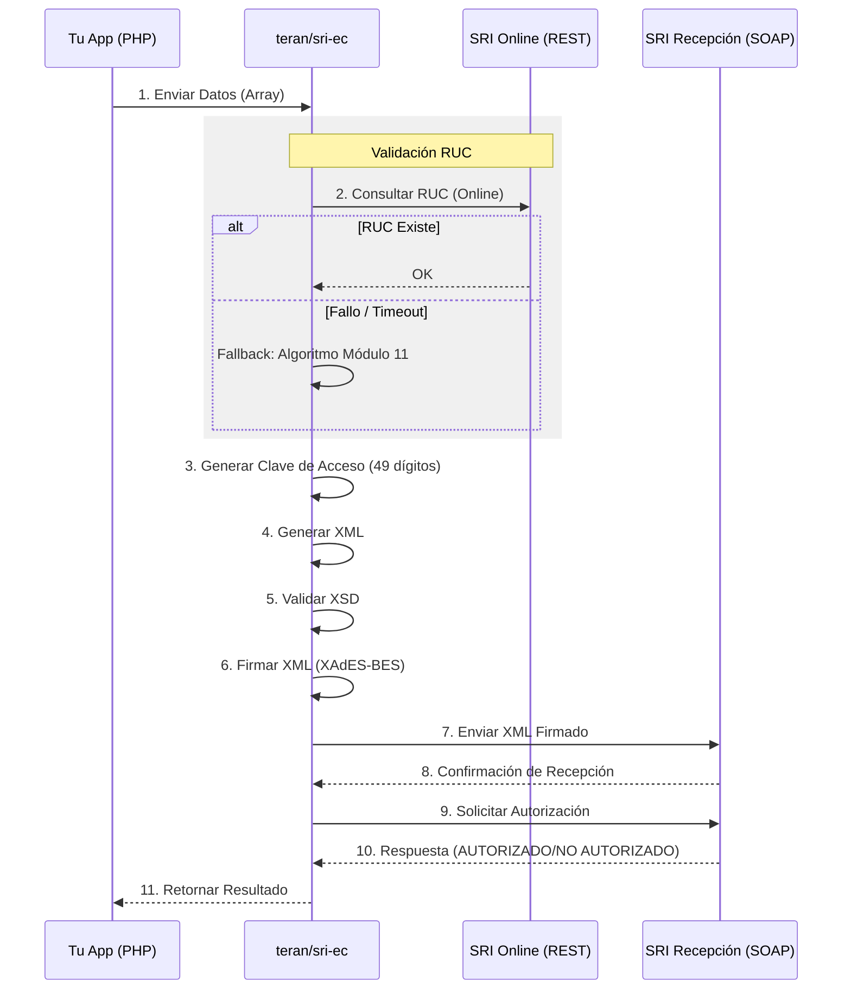

# 🇪🇨 teran-sri-ec

[](https://packagist.org/packages/teran/sri-ec)
[](LICENSE.md)
[](https://packagist.org/packages/teran/sri-ec)
[](https://www.php.net/)

Librería profesional y de alto rendimiento para **Facturación Electrónica del SRI Ecuador**. Simplifica el proceso de generación, firma y autorización de documentos electrónicos según los últimos requerimientos técnicos del SRI.

## ✨ Características Principales

- ✅ **Firma XAdES-BES Completa**: Firma digital con IssuerSerial, RSAKeyValue y SignedDataObjectProperties.
- ✅ **Todos los Comprobantes**: Facturas, Notas de Crédito/Débito, Retenciones y Guías de Remisión.
- ✅ **Validación XSD**: Validación local contra esquemas oficiales del SRI.
- ✅ **Cliente SOAP**: Comunicación robusta con servicios web del SRI (Recepción y Autorización).
- ✅ **Clave de Acceso**: Generación automática con algoritmo Módulo 11.
- ✅ **Validación de RUC**: Online (SRI) con fallback local.
- ✅ **Soporte de Ambientes**: `pruebas` y `produccion`.

## 📋 Tipos de Comprobantes Soportados

| Tipo | Código | Método |
|------|--------|--------|
| Factura | 01 | `facturaFromArray()` |
| Nota de Crédito | 04 | `notaCreditoFromArray()` |
| Nota de Débito | 05 | `notaDebitoFromArray()` |
| Guía de Remisión | 06 | `guiaRemisionFromArray()` |
| Comprobante de Retención | 07 | `retencionFromArray()` |

## 🔄 Flujo de Trabajo



## 🚀 Instalación

```bash
composer require teran/sri-ec
```

## 🛠 Requisitos

- **PHP**: `^8.1`
- **Extensiones**: `ext-curl`, `ext-dom`, `ext-libxml`, `ext-openssl`, `ext-soap`

## 📖 Uso

### Configuración Básica

```php
use Teran\Sri\SRI;

// Inicializar en ambiente 'pruebas' o 'produccion'
$sri = new SRI('pruebas');

// Configurar tu firma digital (.p12)
$p12 = file_get_contents('ruta/a/tu/firma.p12');
$sri->setFirma($p12, 'tu_contraseña_p12');
```

### Procesar una Factura

```php
$facturaData = [
    'infoTributaria' => [
        'ambiente' => '1', // 1=Pruebas, 2=Producción
        'razonSocial' => 'MI EMPRESA S.A.',
        'ruc' => '1790011001001',
        'estab' => '001',
        'ptoEmi' => '001',
        'secuencial' => '000000001',
        'dirMatriz' => 'Quito, Ecuador',
    ],
    'infoFactura' => [
        'fechaEmision' => '26/01/2026',
        'tipoIdentificacionComprador' => '05',
        'razonSocialComprador' => 'CLIENTE FINAL',
        'identificacionComprador' => '9999999999',
        'totalSinImpuestos' => '100.00',
        'totalDescuento' => '0.00',
        'importetotal' => '112.00',
        'totalConImpuestos' => [
            ['codigo' => '2', 'codigoPorcentaje' => '2', 'baseImponible' => '100.00', 'valor' => '12.00']
        ],
        'pagos' => [
            ['formaPago' => '01', 'total' => '112.00']
        ]
    ],
    'detalles' => [
        [
            'codigoPrincipal' => 'PROD001',
            'descripcion' => 'Producto de prueba',
            'cantidad' => '1.00',
            'precioUnitario' => '100.00',
            'descuento' => '0.00',
            'precioTotalSinImpuesto' => '100.00',
            'impuestos' => [
                ['codigo' => '2', 'codigoPorcentaje' => '2', 'tarifa' => '12.00', 'baseImponible' => '100.00', 'valor' => '12.00']
            ]
        ]
    ]
];

try {
    $resultado = $sri->facturaFromArray($facturaData);

    echo "Clave de Acceso: " . $resultado['claveAcceso'] . "\n";
    echo "Estado: " . $resultado['autorizacion']->estado . "\n";

    if ($resultado['autorizacion']->estado === 'AUTORIZADO') {
        echo "Número de Autorización: " . $resultado['autorizacion']->numeroAutorizacion . "\n";
        echo "Fecha de Autorización: " . $resultado['autorizacion']->fechaAutorizacion . "\n";
    } else {
        foreach ($resultado['autorizacion']->mensajes as $mensaje) {
            echo "Error [{$mensaje->identificador}]: {$mensaje->mensaje}\n";
        }
    }
} catch (\Teran\Sri\Exceptions\ValidationException $e) {
    echo "Error de validación: " . $e->getMessage() . "\n";
    foreach ($e->getErrors() as $error) {
        echo "- $error\n";
    }
}
```

### Procesar Nota de Crédito

```php
$notaCreditoData = [
    'infoTributaria' => [
        'ambiente' => '1',
        'razonSocial' => 'MI EMPRESA S.A.',
        'ruc' => '1790011001001',
        'estab' => '001',
        'ptoEmi' => '001',
        'secuencial' => '000000001',
        'dirMatriz' => 'Quito, Ecuador',
    ],
    'infoNotaCredito' => [
        'fechaEmision' => '26/01/2026',
        'tipoIdentificacionComprador' => '05',
        'razonSocialComprador' => 'CLIENTE FINAL',
        'identificacionComprador' => '9999999999',
        'codDocModificado' => '01', // Factura
        'numDocModificado' => '001-001-000000001',
        'fechaEmisionDocSustento' => '25/01/2026',
        'totalSinImpuestos' => '50.00',
        'valorModificacion' => '56.00',
        'moneda' => 'DOLAR',
        'totalConImpuestos' => [
            ['codigo' => '2', 'codigoPorcentaje' => '2', 'baseImponible' => '50.00', 'valor' => '6.00']
        ],
        'motivo' => 'Devolución parcial de mercadería'
    ],
    'detalles' => [/* ... */]
];

$resultado = $sri->notaCreditoFromArray($notaCreditoData);
```

### Procesar Comprobante de Retención

```php
$retencionData = [
    'infoTributaria' => [
        'ambiente' => '1',
        'razonSocial' => 'MI EMPRESA S.A.',
        'ruc' => '1790011001001',
        'estab' => '001',
        'ptoEmi' => '001',
        'secuencial' => '000000001',
        'dirMatriz' => 'Quito, Ecuador',
    ],
    'infoCompRetencion' => [
        'fechaEmision' => '26/01/2026',
        'tipoIdentificacionSujetoRetenido' => '04',
        'razonSocialSujetoRetenido' => 'PROVEEDOR S.A.',
        'identificacionSujetoRetenido' => '1790011001001',
        'periodoFiscal' => '01/2026',
    ],
    'docsSustento' => [
        [
            'codSustento' => '01',
            'codDocSustento' => '01',
            'numDocSustento' => '001-001-000000001',
            'fechaEmisionDocSustento' => '25/01/2026',
            'totalSinImpuestos' => '1000.00',
            'importeTotal' => '1120.00',
            'retenciones' => [
                [
                    'codigo' => '1', // Renta
                    'codigoRetencion' => '303',
                    'baseImponible' => '1000.00',
                    'porcentajeRetener' => '10.00',
                    'valorRetenido' => '100.00'
                ]
            ]
        ]
    ]
];

$resultado = $sri->retencionFromArray($retencionData);
```

### Consultar Estado de Autorización

```php
$claveAcceso = '2601202601179001100100110010010000000011234567811';
$autorizacion = $sri->consultarAutorizacion($claveAcceso);

if ($autorizacion->estado === 'AUTORIZADO') {
    echo "Comprobante autorizado\n";
} else {
    echo "No autorizado: " . $autorizacion->mensajes[0]->mensaje . "\n";
}
```

### Solo Firmar XML (Sin Enviar)

```php
$xmlFirmado = $sri->firmarXml($xmlSinFirma);
```

## 🏗 Uso Avanzado

Para implementaciones personalizadas, puedes usar `ComprobanteInterface`:

```php
use Teran\Sri\Strategies\ComprobanteInterface;

class MiDocumentoPersonalizado implements ComprobanteInterface {
    public function getTipo(): string { return '01'; }
    public function generarXml(): string { /* ... */ }
    public function getXsdPath(): string { /* ... */ }
    public function getDatosClave(): array { /* ... */ }
}

$resultado = $sri->procesar(new MiDocumentoPersonalizado());
```

## 📂 Estructura del Proyecto

```
src/
├── SRI.php                    # Clase principal
├── Generators/                # Generadores de XML
│   ├── FacturaGenerator.php
│   ├── NotaCreditoGenerator.php
│   ├── NotaDebitoGenerator.php
│   ├── RetencionGenerator.php
│   └── GuiaRemisionGenerator.php
├── Signature/
│   └── XadesSignature.php     # Firma XAdES-BES
├── Soap/
│   └── SriSoapClient.php      # Cliente SOAP
├── Schema/
│   ├── XsdValidator.php
│   └── BusinessValidator.php
├── Dto/
│   ├── RecepcionResponse.php
│   ├── AutorizacionResponse.php
│   └── Mensaje.php
├── Utils/
│   ├── ClaveAcceso.php        # Generador Módulo 11
│   └── RucValidator.php
└── Exceptions/
    └── SriException.php
```

## 🔐 Estructura de Firma XAdES-BES

La firma digital cumple con el estándar XAdES-BES requerido por el SRI:

```xml
<ds:Signature>
    <ds:SignedInfo>
        <ds:Reference URI="#comprobante">...</ds:Reference>
        <ds:Reference URI="#SignedProperties-...">...</ds:Reference>
        <ds:Reference URI="#Certificate-...">...</ds:Reference>
    </ds:SignedInfo>
    <ds:SignatureValue>...</ds:SignatureValue>
    <ds:KeyInfo>
        <ds:X509Data>
            <ds:X509Certificate>...</ds:X509Certificate>
        </ds:X509Data>
        <ds:KeyValue>
            <ds:RSAKeyValue>
                <ds:Modulus>...</ds:Modulus>
                <ds:Exponent>...</ds:Exponent>
            </ds:RSAKeyValue>
        </ds:KeyValue>
    </ds:KeyInfo>
    <ds:Object>
        <xades:QualifyingProperties>
            <xades:SignedProperties>
                <xades:SignedSignatureProperties>
                    <xades:SigningTime>...</xades:SigningTime>
                    <xades:SigningCertificate>
                        <xades:Cert>
                            <xades:CertDigest>...</xades:CertDigest>
                            <xades:IssuerSerial>...</xades:IssuerSerial>
                        </xades:Cert>
                    </xades:SigningCertificate>
                </xades:SignedSignatureProperties>
                <xades:SignedDataObjectProperties>
                    <xades:DataObjectFormat>
                        <xades:Description>Comprobante electrónico</xades:Description>
                        <xades:MimeType>text/xml</xades:MimeType>
                        <xades:Encoding>UTF-8</xades:Encoding>
                    </xades:DataObjectFormat>
                </xades:SignedDataObjectProperties>
            </xades:SignedProperties>
        </xades:QualifyingProperties>
    </ds:Object>
</ds:Signature>
```

## 🤝 Contribuir

¡Las contribuciones son bienvenidas! No dudes en enviar un Pull Request.

## 📄 Licencia

Licencia MIT. Por favor consulta el [Archivo de Licencia](LICENSE.md) para más información.

---
Desarrollado con ❤️ por [Jonathan Terán](https://github.com/jonathanteran)
