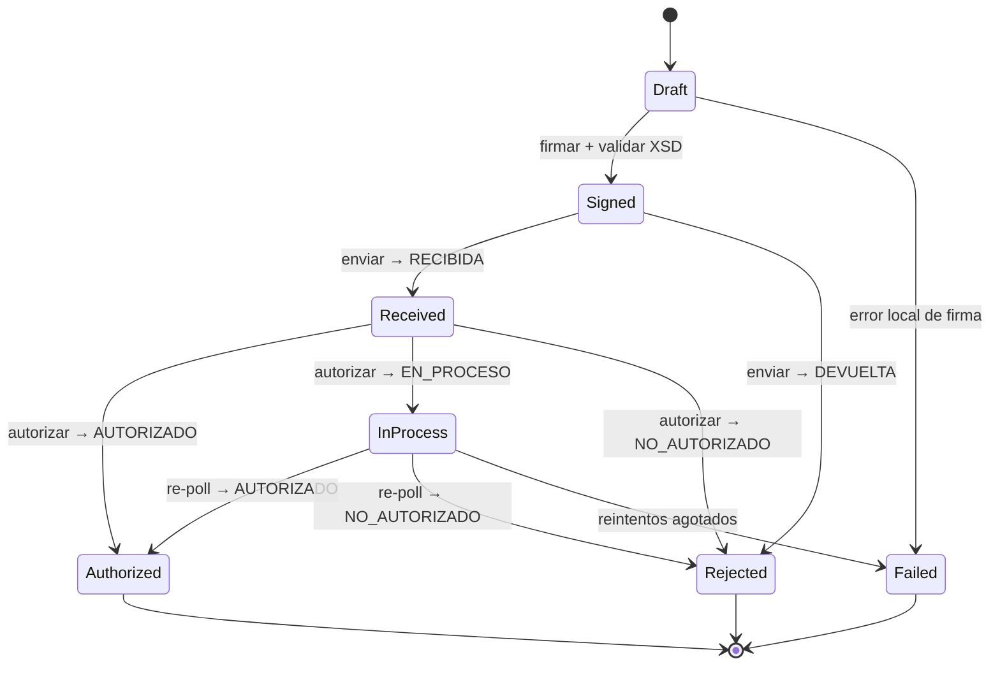

# Diseño: `amephia/sri-ec` 2.0 — Núcleo seguro, confiable y envío masivo

- **Fecha:** 2026-06-04
- **Autor:** Jonathan Terán (con Claude)
- **Estado:** Aprobado (diseño) — pendiente de plan de implementación
- **Paquete:** `amephia/sri-ec` (repo `JonathanTeran/teran-sri-ec`, namespace `Teran\Sri\`)

---

## 1. Contexto y objetivos

`amephia/sri-ec` es una librería PHP de facturación electrónica para el SRI de Ecuador (firma XAdES-BES + comunicación con los web services del SRI). La versión 1.x funciona, pero:

- Está **accidentalmente acoplada a Laravel** (`\Illuminate\Support\Facades\Log` y `base_path()` hardcodeados) pese a declarar solo `psr/log`. Esto **rompe a usuarios no-Laravel** (fatal error) y **filtra el XML firmado y la respuesta SOAP a los logs en cada emisión**.
- Tiene riesgos de seguridad en el manejo del certificado (password en `argv`, clave privada a temp predecible), **TLS deshabilitado** al consultar el RUC, **escape XML incorrecto** (rompe con `&`), y **faltan 4 de los 5 XSD** (la validación se salta en silencio).
- No soporta **envío masivo**.

### Objetivos de la 2.0

1. **Funciona perfecto:** correcto y reproducible — la firma se valida contra XSD oficial y se verifica criptográficamente en cada build (golden tests).
2. **Seguro:** sin fuga de datos sensibles, manejo de certificado endurecido, TLS verificado, escape XML correcto.
3. **Confiable a escala:** envío masivo reanudable, idempotente y tolerante a fallos (miles/hora).
4. **Clase mundial:** núcleo agnóstico de framework, tipado fuerte, PHPStan máximo, CI, docs.
5. **Migración casi invisible** para los usuarios actuales de 1.x.

## 2. Decisiones tomadas

| Tema | Decisión |
|---|---|
| Versionado | **2.0 limpio**; rama `1.x` recibe solo parches de seguridad |
| Framework | **Núcleo agnóstico** (PSR-3 logging, PSR-18 HTTP) **+ adapter Laravel** en paquete aparte |
| Escala masivo | **Cola + workers**, estado persistente, reanudable (miles/hora) |
| Modelo de datos | **DTOs tipados inmutables + `::fromArray()`** |
| PHP mínimo | **8.2** |
| Concurrencia | **Enfoque A:** workers + transporte síncrono (concurrencia operacional, no async en proceso) |
| Transporte | **`SriTransportInterface`** sobre PSR-18 (reemplaza `SoapClient`); TLS verificado |
| Migración | **Shim de compatibilidad en 2.0:** la API 1.x sigue funcionando, deprecada; se elimina en 3.0 |
| Namespace | Se mantiene `Teran\Sri\` (evita churn y ayuda a la compatibilidad) |

## 3. Arquitectura

### 3.1 Estructura de paquetes

```
amephia/sri-ec            (NÚCLEO — 0 dependencias de framework)
  src/
    SRI.php               → SHIM legacy DEPRECADO (API 1.x sobre el motor 2.0)
    SriClient.php         → entrada nueva (emisión individual y acceso a batch)
    Config/               → Environment (enum), opciones de firma/transporte
    Documents/            → DTOs inmutables: Factura, NotaCredito, NotaDebito,
                            GuiaRemision, Retencion + Detalle, Impuesto, Pago, DocSustento
                            + enums de catálogos (Ambiente, TipoComprobante, FormaPago…)
    Signing/              → Certificate, CertificateLoader, XadesSigner, SignatureOptions
    Xml/                  → serializadores DOM (escape correcto) + XsdValidator (5 esquemas)
    Transport/            → SriTransportInterface, Psr18Transport, SoapEnvelope, ResponseParser
    Emission/             → EmissionResult (ArrayAccess), EmissionStatus (enum)
    Batch/                → Comprobante (entidad de estado), ComprobanteState (enum),
                            BatchProcessor, EmitStep, AuthorizeStep, RetryPolicy
    Contracts/            → ComprobanteRepositoryInterface, BatchDispatcherInterface,
                            RateLimiterInterface, ClockInterface, RucValidatorInterface
    Support/              → InMemory*/Pdo* (implementaciones de referencia), SystemClock
    Exceptions/           → jerarquía tipada
  resources/xsd/          → factura, notaCredito, notaDebito, guiaRemision, comprobanteRetencion

amephia/sri-ec-laravel    (ADAPTER — opcional)
  ServiceProvider, config/sri.php, Facade (Sri),
  EloquentComprobanteRepository (+migración), QueueDispatcher,
  Jobs (EmitJob, AuthorizeJob), CacheRateLimiter,
  Comandos Artisan (sri:emit, sri:status, sri:retry-failed)
```

> **Nota de naming:** la entrada nueva es `SriClient` (no `Sri`) para evitar colisión de autoload con la clase legacy `SRI` en sistemas de archivos *case-insensitive* (macOS/Windows).

### 3.2 Concurrencia (Enfoque A)

El SRI **no tiene endpoint de lote**: recibe uno a uno (`RecepcionComprobantesOffline`) y autoriza de forma **asíncrona** (`AutorizacionComprobantesOffline` puede responder `EN PROCESO`). Por tanto el "masivo" es **orquestación del lado del cliente**:

- Cada documento es un *job* en cola. La concurrencia se logra corriendo **N workers** (escala horizontal).
- Estado persistido (reanudable), clave de acceso como idempotencia, rate-limiter para no provocar bloqueos del SRI.
- No se usa async en proceso (curl_multi/AMP): innecesario para el volumen objetivo y frágil con SOAP. El `SriTransportInterface` permite añadirlo más adelante sin tocar el resto.

## 4. Fase 1 — Núcleo seguro y confiable

### 4.1 API pública (emisión individual)

```php
use Teran\Sri\SriClient;
use Teran\Sri\Config\Environment;
use Teran\Sri\Signing\Certificate;
use Teran\Sri\Documents\Factura;

$sri = new SriClient(
    environment: Environment::Pruebas,
    certificate: Certificate::fromP12($p12Bytes, $password),  // carga y valida UNA vez
    transport:   Psr18Transport::default(),                   // o inyectas tu cliente PSR-18
    logger:      $psr3Logger,                                 // opcional → NullLogger
);

$factura = Factura::fromArray([...]);   // valida en construcción → InvalidDocumentException
$result  = $sri->emit($factura);        // firmar → validar XSD → enviar → autorizar

$result->status;               // EmissionStatus: Authorized | Rejected | InProcess | Received
$result->claveAcceso;          // string
$result->authorizationNumber;  // ?string
$result->messages;             // Message[]
$result->signedXml;            // string
$result->authorizedXml;        // ?string
```

Piezas sueltas para casos avanzados: `$sri->sign($doc): string`, `$sri->checkAuthorization($clave): AuthorizationResult`.

### 4.2 Modelo de documentos (DTOs)

- Clases `readonly` inmutables que validan en el constructor. `::fromArray()` con **las mismas llaves de 1.x**.
- **Dinero decimal-seguro:** value object `Monto` (escala fija, sin `(float)`), evitando los descuadres de centavos que produce `number_format((float)...)` y que el SRI rechaza.
- Catálogos como **enums** (`Ambiente`, `TipoEmision`, `TipoComprobante`, `FormaPago`, `CodigoImpuesto`, `TipoIdentificacion`, `CodigoPorcentajeIVA`, …).

### 4.3 Firma XAdES-BES — segura y reproducible

Se separa `CertificateLoader` (P12 → `Certificate`) de `XadesSigner` (documento → XML firmado). Fixes embebidos respecto a 1.x:

| Problema actual (1.x) | Solución 2.0 |
|---|---|
| `base_path('storage/app/final_signed.xml')` escribe el XML firmado en cada firma | **Eliminado** |
| Password del `.p12` en `argv` (visible en `ps aux`) | `-passin stdin` vía `proc_open`; nunca en línea de comandos |
| Temp predecible (`uniqid()`) + clave privada PEM en disco | `tempnam()` + `chmod(0600)` + borrado garantizado en `finally`; el PEM descifrado se lee a memoria y se borra de inmediato |
| Publicidad `ECUAFACT / ecuanexus.com` incrustada en cada comprobante | `SignatureOptions->description` configurable; default genérico |
| `SigningTime` con `date()` no testeable | `ClockInterface` inyectable (`SystemClock` por defecto) |

Se mantiene SHA-1 (lo exige el SRI) configurable, y soporte RSA + ECDSA. **Garantía de confiabilidad:** golden test con certificado de prueba fijo + reloj fijo → XML firmado byte-idéntico, válido contra XSD y verificable criptográficamente.

### 4.4 XML y validación

- Se elimina el bug de escape: nunca `createElement($name, $value)` (rompe con `&`, p. ej. "ALMACENES J&J"); se usan nodos de texto que escapan correctamente.
- Se agregan los **4 XSD faltantes** (NC, ND, Guía, Retención). La validación XSD **siempre corre** (pre y post-firma); si falta un esquema, **falla ruidosamente** (no se salta en silencio como hoy).

### 4.5 Transporte y red

- `Psr18Transport`: arma el envelope SOAP, hace POST a los endpoints del SRI, **TLS verificado siempre**, timeouts de conexión y lectura configurables.
- Reintentos **idempotency-safe**: ante fallo de red no reenvía a ciegas; reconsulta autorización por clave de acceso antes de reintentar.
- `RucValidatorInterface` opcional con **TLS verificado** (hoy en `false`); se elimina la lógica muerta donde "online no afecta el resultado".

### 4.6 Transversal

- **PSR-3 en todo**; cero facades, cero `error_log`/`print_r`. Datos sensibles (XML, password) nunca en `info`; a lo sumo `debug` redactado y apagado por defecto.
- Jerarquía de excepciones: `SriException` → `InvalidDocumentException`, `CertificateException`, `SignatureException`, `TransportException`, `RejectedBySriException`.
- `declare(strict_types=1)` + PHPStan máximo en todo el núcleo.

## 5. Fase 2 — Motor de envío masivo

### 5.1 Máquina de estados (por documento)



Cada transición es **atómica y persistida**, con *optimistic locking* (columna `version`) para que dos workers no procesen el mismo documento a la vez.

### 5.2 Garantías de fiabilidad

- **Idempotencia:** antes de cualquier llamada al SRI se lee el estado persistido; nunca se reenvía `Received`/`Authorized`. La clave de acceso es la llave natural. Si un worker se cae, al reiniciar reconcilia consultando autorización (el SRI ya tiene el comprobante).
- **Reintentos con criterio:**
  - *Transitorios* (timeout, 5xx, SRI saturado): backoff exponencial + jitter, con tope de intentos y de tiempo total.
  - *`EN_PROCESO`*: agenda de re-consulta (3s, 10s, 30s, 2m, 10m…) hasta un tope.
  - *Terminales* (`DEVUELTA`, `NO_AUTORIZADO`, documento inválido): sin reintento; se guardan motivos.
- **Rate-limiting:** `RateLimiterInterface` token-bucket, **global y por RUC emisor**.
- **Reanudable:** todo el estado vive en BD.

### 5.3 Contratos e implementaciones

| Interfaz (núcleo) | Referencia (núcleo) | Laravel (adapter) |
|---|---|---|
| `ComprobanteRepositoryInterface` | `InMemoryRepository`, `PdoRepository` | `EloquentComprobanteRepository` (+migración) |
| `BatchDispatcherInterface` | `SynchronousDispatcher` (inline) | Queue jobs (`EmitJob`/`AuthorizeJob`, `delay()`, únicos por clave) |
| `RateLimiterInterface` | `InMemoryRateLimiter` | Cache/Redis |
| `EventDispatcherInterface` (PSR-14, opcional) | no-op | eventos Laravel (`ComprobanteAuthorized`/`…Rejected`/`…Failed`) |

### 5.4 API del masivo

```php
$batch = $sri->batch();
foreach ($documentos as $doc) {
    $batch->add($doc);          // persiste Draft, devuelve claveAcceso
}
$batchId = $batch->dispatch();  // encola todos (async)

$resumen = $sri->batchStatus($batchId);
// → ['authorized'=>980, 'rejected'=>5, 'in_process'=>12, 'failed'=>3]
```

Para volúmenes chicos o scripts: `$batch->run()` procesa **inline** con el `SynchronousDispatcher` (sin infraestructura de cola).

### 5.5 Adapter Laravel

`EmitJob`/`AuthorizeJob` como `ShouldQueue` con `WithoutOverlapping` por clave; re-polls vía `->delay()`. Comandos `sri:emit`, `sri:status`, `sri:retry-failed`. Escala con `queue:work`.

## 6. Compatibilidad y migración (que "casi no se sienta")

**Estrategia: agregar y deprecar, nunca romper de golpe.**

1. **Shim legacy:** la clase `Teran\Sri\SRI` conserva `facturaFromArray()`, `notaCreditoFromArray()`, `setFirma()`, `procesar()`, `firmarXml()`, `consultarAutorizacion()` con la misma firma, delegando internamente al motor 2.0. El código actual **corre sin cambiar una línea**; solo se sube el constraint `^1.0` → `^2.0`.
2. **Resultado compatible:** `EmissionResult` implementa `ArrayAccess`, así `$result['claveAcceso']` (1.x) y `$result->claveAcceso` (2.0) funcionan, con las mismas llaves.
3. **Avisos de deprecación:** `trigger_error(..., E_USER_DEPRECATED)` en los métodos legacy → aparecen como *deprecations* sin romper. Más `UPGRADE.md` con tabla vieja→nueva y reglas **Rector** opcionales para reescribir llamadas (`vendor/bin/rector`).
4. **Eliminación:** el shim se retira en **3.0**.
5. **Protección inmediata de los actuales:** se publica **`1.1.1`** en la rama 1.x con los fixes críticos de seguridad (quitar `Illuminate\Log` que filtra el XML, quitar `base_path()`, TLS del RUC, escape XML), de modo que los usuarios actuales quedan seguros **hoy**, antes de migrar.

## 7. Estrategia de pruebas (garantiza "funciona perfecto")

- **Golden-file de firma (cornerstone):** cert de prueba + `Clock` fijos → XML firmado byte-idéntico, válido contra XSD y verificado criptográficamente.
- **Conformidad XSD:** cada tipo de comprobante valida contra los 5 esquemas oficiales.
- **Clave de acceso (Módulo 11):** vectores conocidos + bordes (`dv=10→1`, `dv=11→0`).
- **Transporte:** PSR-18 mockeado con respuestas reales grabadas del SRI (`RECIBIDA`/`DEVUELTA`/`AUTORIZADO`/`EN_PROCESO`/`NO_AUTORIZADO`).
- **Máquina de estados:** todas las transiciones, idempotencia (reejecutar no reenvía), topes de reintento, carrera de dos workers (optimistic lock).
- **Integración real (opcional, detrás de flag):** ambiente *pruebas* del SRI con cert de test, solo en CI con secreto.
- **Calidad:** PHPStan máximo + `strict_types`, PHP-CS-Fixer (PSR-12), **Infection** (mutation testing) en módulos críticos, matriz CI **PHP 8.2/8.3/8.4**, cobertura ≥90% en el núcleo.

## 8. Manejo de errores

- Excepciones tipadas; *fail-fast* en errores de programación (documento inválido) vs. recuperables (transporte) que maneja el motor.
- Se eliminan los `catch (\Throwable) { /* silence */ }` y los skips silenciosos de XSD.
- **Redacción de datos sensibles** en logs y mensajes de excepción.

## 9. Empaquetado y cadena de suministro

- `vendor/` fuera de git; `.gitattributes` con `export-ignore` (no enviar tests/ejemplos en el dist); `composer.json` con `authors`/`support`/`keywords`; archivo `LICENSE`; sin `.DS_Store`.
- `SECURITY.md` con divulgación responsable; Dependabot; dependencias fijadas.
- GitHub Actions: tests + PHPStan + CS + Infection + validación XSD en cada PR.

## 10. Entrega por fases (cada una con su plan)

- **Fase 0 — `1.1.1` (rama 1.x):** parches de seguridad retrocompatibles. *(rápida, desbloquea a los usuarios actuales)*
- **Fase 1 — Núcleo 2.0:** documentos tipados, firma segura, XML/XSD, transporte PSR-18, emisión individual, shim de compat, empaquetado.
- **Fase 2 — Motor masivo:** máquina de estados, contratos, implementaciones de referencia, API de batch.
- **Fase 3 — Clase mundial + adapter Laravel:** CI, Infection, docs, `amephia/sri-ec-laravel`.

## 11. Breaking changes (de 1.x a 2.0, mitigados por el shim)

- API idiomática nueva (`SriClient::emit(Document)`) — la vieja sigue vía shim deprecado.
- Catálogos de clases a enums — se mantienen constantes/aliases donde aplique.
- `SoapClient` directo → `SriTransportInterface` (interno; no afecta al usuario del shim).
- PHP mínimo 8.1 → 8.2.

## 12. Fuera de alcance (YAGNI por ahora)

- Async en proceso (curl_multi/AMP) — el `SriTransportInterface` lo permite después.
- Multi-tenant/sharding distribuido — solo si evoluciona a un SaaS.
- Generación de RIDE/PDF y envío de email del comprobante.
- Otros documentos fuera de los 5 actuales.

## 13. Preguntas abiertas

- Tabla(s) exactas del `EloquentComprobanteRepository` (esquema de `sri_comprobantes`) — se define en el plan de Fase 2.
- ¿Mono-repo con subtree para el adapter o repos separados desde el día 1? (Diseño asume paquete separado; puede empezar como subtree.)
- Cliente PSR-18 por defecto sugerido en docs (Guzzle/Symfony HttpClient) sin imponerlo como dependencia dura del núcleo.
